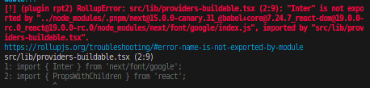

<h1>Next Font Issue</h1>
<p>In the current canary version of Next.js, importing Next.js fonts in any buildable Next.js library is not supported. Attempting to do so will result in a build failure, with an error indicating that the fonts are not exported from the package.</p>


<h2>Use Cases</h2>
<ol>
    <li>Creating a custom theme library for various Next.js applications.</li>
    <li>Utilizing [buildable libraries](https://nx.dev/concepts/buildable-and-publishable-libraries#buildable-libraries) to enable incremental building capabilities.</li>
</ol>

<h2>Libraries in this repo</h2>
<table>
    <tr>
        <th>Library</th>
        <th>Buildable</th>
        <th>Comments</th>
    </tr>
    <tr>
        <td>providers</td>
        <td>No</td>
        <td>The Next.js app compiles successfully [with this library](./apps/next-app/src/app/layout.tsx).</td>
    </tr>
    <tr>
        <td>providers-buildable</td>
        <td>Yes</td>
        <td>The library fails to build successfully due to the font issue.</td>
    </tr>
</table>

<h2>Building the Next.js App</h2>
<p>To build the Next.js app, run the following commands:</p>

```bash
pnpm install
```

```bash
nx build next-app
```
<p>Notice that the app builds successfully with the Next.js canary version. This is because the application uses the font provider from a non-buildable library and does not import anything from the buildable library.</p>

<h2>Building the "providers-buildable" library</h2>
<p>Run the following commands to build the library:</p>

```bash 
pnpm install
```

```bash
nx build providers-buildable
```

Notice that the library <a href="./providers-buildable/src/lib/providers-buildable.tsx">imports the "Inter"</a> Google font from "next/font" and observe the error caused by this import.
